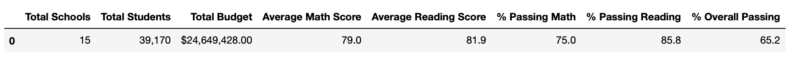
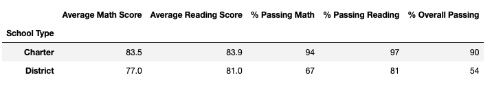

# School District Analysis

## Overview of the Analysis
The purpose of our analysis was to determine whether the 9th graders at Thomas High School had had their grades altered after receiving word from the school board that there may be evidence of academic dishonesty. 

## Results
- How is the district summary affected?

- How is the school summary affected?

- How does replacing the ninth graders’ math and reading scores affect Thomas High School’s performance relative to the other schools?
- How does replacing the ninth-grade scores affect math and reading scores?

- How does replacing the ninth-grade scores affect scores by school spending?

- How does replacing the ninth-grade scores affect school school size?

- How does replacing the ninth-grade scores affect score by school type?

## Summary
Summarize four changes in the updated school district analysis after reading and math scores for the ninth grade at Thomas High School have been replaced with NaNs.
