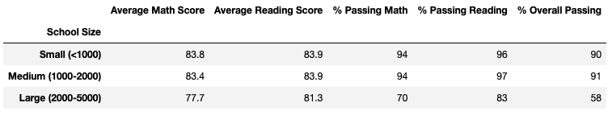

# School District Analysis

## Overview of the Analysis
The purpose of our analysis was to determine whether the 9th graders at Thomas High School had had their grades altered after receiving word from the school board that there may be evidence of academic dishonesty. 

## Results
- As evidenced by the below images, the district summary is not sigificantly affected by removing the scores of the 9th graders from Thomas High School. The overall reading score went down by 0.3 and the average math score went down by 0.2 points. The overall passing percentage went down by 0.1 points.

District Summary Before:

- The school summary is also barely affected by removing these scores. There was only a 9 basis point reduction in the percent of students passing math (93.27% to 93.18%) and a 29 basis point drop in the percent of students passing reading (97.30% to 97.01%). The overall passing percentage went down by 31 basis points (90.94% to 90.63%) as shown in the below images, none of which represent a significant change.

School Summary Before:

School Summary After:

- After removing the Thomas High School 9th graders, Thomas High school remained in 2nd place amongst all schools in the district in terms of overall passing percentage. Removing them did not alter Thomas' ranking within the district.
- Removing these scores also did not affect Thomas' place within the district in terms of math and reading scores either. As evidenced by the images above, Thomas High School remains 7th in the discrict in the percent of students passing math and only moved from 2nd to 3rd in overall percent of students passing reading. We shouldn't really expect them to change much though considering the percentage of 9th grade students passing math and reading were in line with those of other grades on average (see below).

Math Before:

Math After:

Reading Before:

Reading After:

- Replacing the ninth grade scores at Thomas High School also did not change the school spending averages whatsoever. As the two below images show, the scores are the exact same on average by bin before and after removing them.

By School Spending Group Before:

By School Spending Group After:

- The average school size scores also did not change whatsoever after removing the Thomas High School 9th grade scores (see below). Their removal only moved the averaged a fraction of a percent, but not enough to move it one percent either way, when in its final rounded form to the nearest percent.

By School Size Before:

By School Size After:

- The average scores and passing percentages by school type also did not change when rounded to the nearest percentage (see below). Removing the 9th grade scores from Thomas High School were not enough to move the averages an entire percent.

By School Type Before:

By School Type After:

## Summary
One change that came from removing the ninth grade scores from Thomas High School was the overall percentage of students passing, which fell by 0.31%. The school had 90.94% of students passing when the 9th graders were included, but only 90.63% were passing once those scores were removed. Another change was the school's rank within the district for overall percentage of students that are passing reading. They fell from 2nd in the district to 3rd after removing these scores. A third change was the amount of total students in the sample. When including these Thomas High School 9th Graders, there were 39,169 students in the overall analysis, but afterwards that number fell to 38,709 after the 460 students were removed so this new total was used to calculate the percentages of students that were passing for each metric we grouped by. Finally, the total district passing percentage dropped from 65.2% to 64.9%
